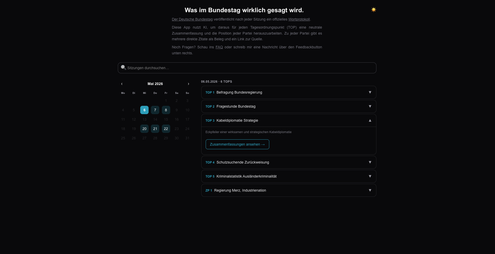
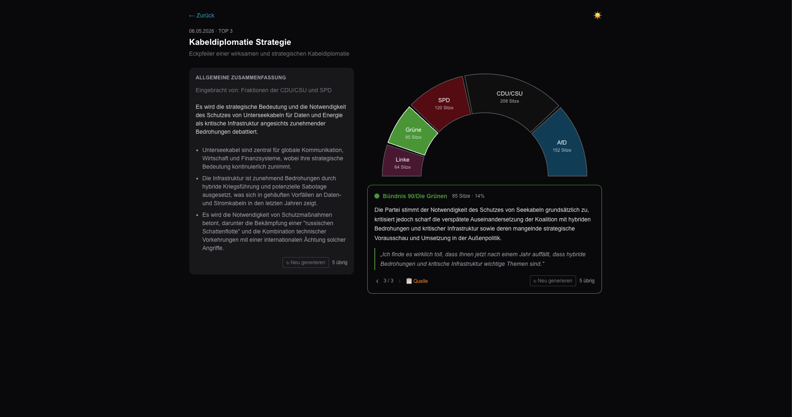

# Bundestag im O-Ton

**Was im Bundestag wirklich gesagt wird.**

Eine Web-App die Plenarprotokolle des Deutschen Bundestages automatisch auswertet und für jeden Tagesordnungspunkt eine neutrale Zusammenfassung sowie die Position jeder Partei — belegt durch direkte Zitate — aufbereitet.

🔗 [bundestag-im-o-ton.de](https://www.bundestag-im-o-ton.de)

---

## Screenshots





---

## Tech Stack

| Schicht | Technologie |
|---|---|
| Frontend | Next.js 15, TypeScript, Tailwind CSS v4 |
| Backend | FastAPI, Python, LangChain |
| Embeddings | Gemini `gemini-embedding-001` |
| LLM | Gemini 2.5 Flash |
| Vektordatenbank | ChromaDB |
| Datenspeicher | Google Cloud Storage |
| Deployment Frontend | Vercel |
| Deployment Backend | Google Cloud Run |

---

## Architektur

```
┌─────────────────────────────────────────────────┐
│                   Vercel (CDN)                  │
│              Next.js App Router                 │
│   Server Components → fetchAllTopics()          │
│   Client Components → localStorage Cache        │
└─────────────────┬───────────────────────────────┘
                  │ HTTPS
┌─────────────────▼───────────────────────────────┐
│              Cloud Run (Backend)                │
│                   FastAPI                       │
│  /topics  /summaries  /admin/update             │
│  ChromaDB (in-memory, von GCS geladen)          │
└──────────┬──────────────────┬───────────────────┘
           │                  │
┌──────────▼──────┐  ┌────────▼────────────────────┐
│  Google Cloud   │  │     Bundestag Open Data      │
│    Storage      │  │  dip.bundestag.de (XML API)  │
│  chroma_store/  │  │  Plenarprotokolle als XML    │
│  tops.json      │  └─────────────────────────────-┘
│  summaries_     │
│  cache.json     │
└─────────────────┘
```

**Datenpfad beim Start:** Cloud Run lädt ChromaDB + `tops.json` + `summaries_cache.json` von GCS in den Arbeitsspeicher.

**Datenpfad bei Anfrage:** Nutzer öffnet einen TOP → Backend sucht relevante Reden in ChromaDB → Gemini 2.5 Flash generiert Zusammenfassung → Ergebnis wird gecacht.

---

## Datenpipeline

```
Bundestag XML
     │
     ▼
XML Parsing (tools.py)
  • Reden nach Partei und TOP extrahieren
  • Tagesordnungspunkte + Metadaten erfassen
     │
     ▼
Embedding (Gemini gemini-embedding-001)
  • Reden in 3072-dim. Vektoren umwandeln
  • In ChromaDB speichern (top_key als Metadatum)
     │
     ▼
GCS Upload
  • ChromaDB-Store → gs://…/chroma_store_gemini/
  • tops.json → gs://…/tops.json
     │
     ▼
On-Demand Zusammenfassung
  • Nutzer öffnet TOP → RAG-Abfrage auf ChromaDB
  • Gemini 2.5 Flash: allgemeine Zusammenfassung + Parteiposition
  • Ergebnis in summaries_cache.json gespeichert
```

Neue Sitzungen werden über den `/admin/update` Endpoint geladen (geschützt via Bearer Token). Dieser erkennt automatisch welche Sitzungen noch nicht eingebettet sind.

---


## Datenquelle

Die Protokolle stammen aus dem offiziellen Open-Data-Angebot des Deutschen Bundestages:
[bundestag.de/services/opendata](https://www.bundestag.de/services/opendata)
